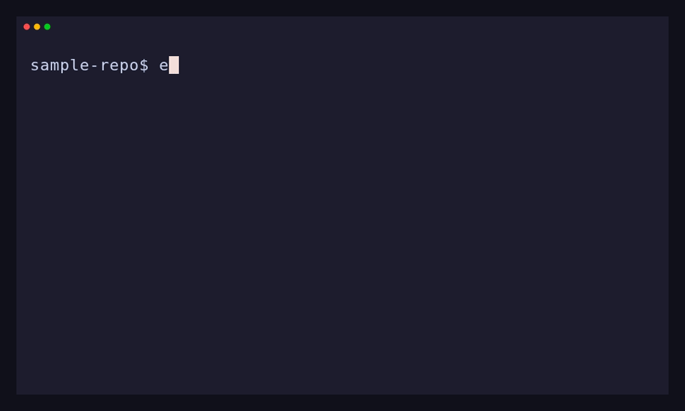

# shelfbox

Keep AI context files, personal configs, and local secrets **visible in your editor** but **invisible to Git** — surviving reclones, worktrees, and index resets.

> Supported on **Linux**, **macOS**, and **Windows**.  
> The default strategy is a symlink; on Windows it requires Developer Mode or an elevated shell.  
> Copy mode uses regular files and is available where symlink creation is restricted.

## Quick Start



```sh
# Create a local-only file in your repository
touch AGENTS.local.md

# Confirm it exists and is still untracked
git status --short

# Shelve it (keeps the path visible, stores canonical content outside Git)
shelfbox item add AGENTS.local.md

# Confirm Git no longer reports it
git status --short

# Show where shelfbox keeps its store
shelfbox config get store

# List repositories and managed items
shelfbox repo list --format plain
shelfbox item list --format plain
```

> The demo focuses on the add and verification flow. Run `shelfbox item restore AGENTS.local.md` afterward to return to the original state.

## Why shelfbox

Some files need to stay in your repository tree so editors and tools can discover them, but they must never be committed. shelfbox separates those concerns: files remain visible at their original paths, canonical content is stored outside the repo, and Git stays out of the way.

| File | Why shelve it |
|---|---|
| `AGENTS.local.md`, `skills/my-skill/`, etc. | Personal AI assistant instructions |
| `notes/scratch.md` | Personal development notes |
| `config/local.yml` | Machine-specific config overrides |
| `.env` | Local secrets and credentials |

**Common workarounds fail over time:**

- **`.gitignore`** — only affects untracked files. If a file has ever been tracked, adding it to `.gitignore` does not untrack it. Also, `.gitignore` is committed, so personal ignore rules leak into team history.
- **`git update-index --skip-worktree`** — is a local index flag that can be cleared by `git clone`, `git worktree add`, or index resets, often with no clear signal until files show up as modified again.

Manual move-and-symlink setups are possible, but they do not provide lifecycle management. shelfbox adds **tracked ownership** and structured recovery: it materializes files at original paths, keeps them excluded via `.git/info/exclude`, and repairs broken materializations, lost repo associations after reclones, and orphaned store entries.

Canonical shelf data is stored under `<store>/repos/<repo-store-dir>/`: `manifest.json` keeps repository and item metadata, and `items/` keeps the actual file contents. See [Data model](docs/architecture/data-model.md) for details.

## Installation

### Pre-built binary (recommended)

Linux/macOS:

```sh
curl -fsSL https://raw.githubusercontent.com/masa-kjm/shelfbox/main/scripts/install.sh | sh
```

Windows PowerShell:

```powershell
irm https://raw.githubusercontent.com/masa-kjm/shelfbox/main/scripts/install.ps1 | iex
```

The Unix installer uses `~/.local/bin` by default. The PowerShell installer uses `$Env:LOCALAPPDATA\Programs\shelfbox\bin`. To specify a version or directory on Linux/macOS:

```sh
curl -fsSL https://raw.githubusercontent.com/masa-kjm/shelfbox/main/scripts/install.sh | VERSION=v0.1.0 sh
curl -fsSL https://raw.githubusercontent.com/masa-kjm/shelfbox/main/scripts/install.sh | INSTALL_DIR=/usr/local/bin sh
```

Linux installs use the musl binary by default for wider compatibility. To use the GNU libc binary instead:

```sh
curl -fsSL https://raw.githubusercontent.com/masa-kjm/shelfbox/main/scripts/install.sh | LINUX_LIBC=gnu sh
```

### From source

```sh
cargo install --path crates/shelfbox
```

Requires Rust 1.75+ and Git.

## More features

- **Directory shelving** — shelve eligible files under a directory; each file remains an independent item: [`item add <PATH>`](docs/reference/item-commands.md#item-add-path)
- **Recovery after reclone** — re-associate a new clone with an existing shelf after restoring `repos/`: [`repo reclaim`](docs/reference/repo-commands.md#repo-reclaim)
- **Store recovery** — rebuild local cache files from canonical manifests: [`store rebuild-index`](docs/reference/store-commands.md#store-rebuild-index)
- **Copy mode** — leave an independent regular file instead of a symlink, useful when symlink creation is restricted: [Copy mode spec](docs/spec/copy-mode.md)

See [docs/index.md](docs/index.md) for the full documentation set.

## Configuration

Optional config at `~/.config/shelfbox/config.toml` (respects `$XDG_CONFIG_HOME`):

```toml
# store = "/mnt/data/shelfbox-store"   # default: ~/.local/share/shelfbox
# default_format = "table"             # table | plain | json
# materialization = "symlink"          # symlink (default) | copy
# mutation_durability = "require"      # require (default) | best-effort
```

The `--store <PATH>` global flag overrides config at runtime.

> **Note for Windows users:** The default `require` mode depends on directory-level durability guarantees that Windows does not provide. Set `mutation_durability = "best-effort"` to use shelfbox on Windows.

See [Config reference](docs/reference/config-commands.md) for all options and details.

## Non-goals

shelfbox is a **single-machine** tool. Placing the store on external or network-synced storage is not officially supported — sync conflicts may leave items in an inconsistent state.

Multi-machine sync, secret encryption, and team-shared files are out of scope.

## Documentation

- [Getting Started](docs/getting-started.md) — installation, basic concepts, and first-time usage
- [Workflows](docs/workflows.md) — common tasks and recovery procedures  

See [docs/index.md](docs/index.md) for the full documentation set.

## License

MIT
